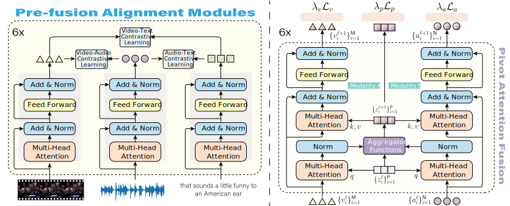

# AcFormer: An Aligned and Compact Transformer for Multimodal Sentiment Analysis
This repository presents the PyTorch implementation of our research work on [AcFormer: An Aligned and Compact Transformer for Multimodal Sentiment Analysis](https://github.com/example/acformer) The goal of this study is to develop an efficient and effective model for analyzing sentiment in multimodal data.

## Model Overview
### Overall Architecture for `AcFormer`
<p align="center">


### `AcFormer` is designed based on the Transformer architecture, with modifications and enhancements to align and compactly process multimodal inputs for sentiment analysis. The model incorporates visual, acoustic and textual modalities and leverages their interactions to improve sentiment prediction accuracy. The details of the model architecture can be found in our paper.

## Environment
- Python 3.8
- Pytorch 1.6.0
- CUDA 10.1
<!-- To build the environment  -->
1. Install all required library
```shell
pip install -r requirements.txt
```
2. Download pre-trained word vectors and pre-trained models
+ [Glove word vectors (glove.840B.300d.zip)](https://nlp.stanford.edu/data/glove.840B.300d.zip)
+ [BERT Model (bert-base-uncased)](https://huggingface.co/bert-base-uncased)
+ [ViT B/16 (vit-base-patch16-224-in21k)](https://huggingface.co/google/vit-base-patch16-224-in21k)

## Dataset
### Data Download
To reproduce our experiments and evaluate the performance of `AcFormer`, we recommend using our processed dataset. Data files (CMU_MOSI, CMU_MOSEI, UR-FUNNY, IEMOCAP, MUStARD, MELD) can be downloaded from [data](https://drive.google.com/drive/folders/1o3onVsZsHpPAZZsY2G7ralSmL2jI508n?usp=sharing).

### Dataset Format
All datasets are saved under `./data/` folder. The format of raw datasets is as follows:
```sh
├── iemocap
│   ├── segmented_audio
│   │   └── Ses01F_impro01_F000.wav
│   ├── segmented_text
│   │   └── text.json
│   └── segmented_video
│       └── Ses01F_impro01_F000.mp4
├── meld
│   ├── segmented_audio
│   │   └── dia0_utt0.wav
│   ├── segmented_text
│   │   └── text.csv
│   └── segmented_video
│       └── dia0_utt0.mp4
├── mosei
│   ├── segmented_audio
│   │   └── _7HVhnSYX1Y_0.mp4.wav
│   ├── segmented_text
│   │   └── text.json
│   └── segmented_video
│       └── _7HVhnSYX1Y_0.mp4
├── mosi
│   ├── segmented_audio
│   │   └── _dI--eQ6qVU_1.wav
│   ├── segmented_text
│   │   └── text.json
│   └── segmented_video
│       └── _dI--eQ6qVU_1.mp4
├── mustard
│   ├── segmented_audio
│   │   └── 1_60.wav
│   ├── segmented_text
│   │   └── text.json
│   └── segmented_video
│       └── 1_60.mp4
```
Note that for the `ur_funny` dataset, we cannot get timestamps corresponding to video/audio clips and original texts. We can only use pre-extracted word alignment features.

For traditional word alignment feature extraction, we recommend the following download plans:

### CMU-MOSI and CMU-MOSEI
- Install [CMU Multimodal SDK](https://github.com/A2Zadeh/CMU-MultimodalSDK). Ensure, you can perform ```from mmsdk import mmdatasdk```.    
>* Download Extracted Features [MOSI and MOSEI](https://drive.google.com/drive/folders/1IBwWNH0XjPnZWaAlP1U2tIJH6Rb3noMI?usp=sharing) and put the contents in `./data` folder..

### UR-FUNNY
- Install [CMU Multimodal SDK](https://github.com/A2Zadeh/CMU-MultimodalSDK). Ensure, you can perform ```from mmsdk import mmdatasdk```.    
>* Download Extracted Features: [UR-FUNNY](https://www.dropbox.com/sh/9h0pcqmqoplx9p2/AAC8yYikSBVYCSFjm3afFHQva?dl=1) and put the contents in `./data` folder.. There are six pickle files in the extracted features folder:
>>*    data_folds
>>*    langauge_sdk
>>*    openface_features_sdk
>>*    covarep_features_sdk
>>*    humor_label_sdk
>>*    word_embedding_list

### IEMOCAP
- Install [CMU Multimodal SDK](https://github.com/A2Zadeh/CMU-MultimodalSDK). Ensure, you can perform ```from mmsdk import mmdatasdk```.    
>* Download Extracted Features: [IEMOCAP](https://www.dropbox.com/sh/hyzpgx1hp9nj37s/AAB7FhBqJOFDw2hEyvv2ZXHxa?dl=0) and put the contents in ./data folder.
>* You can use the following script
```sh
wget https://www.dropbox.com/sh/hyzpgx1hp9nj37s/AADfY2s7gD_MkR76m03KS0K1a/Archive.zip?dl=1
mv 'Archive.zip?dl=1' Archive.zip
unzip Archive.zip
```

## Training Procedure
+ We employ a two-stage training procedure for AcFormer. In the first stage, the model is pre-trained on `MELD` using self-supervised learning objectives to learn meaningful representations.

1. Ensure that you have the required hardware resources (e.g., GPU) and software dependencies installed.

>- option 1:  Clone the code repository from the GitHub link: [AcFormer](https://anonymous.4open.science/r/AcFormer-3F8B/) and change to the project directory: 
```shell
cd acformer/
```
>- option 2: Run the pre-training stage by executing the command:
```shell
sh ./scripts/pretrain.sh {gpus} ./configs/pivotal_pretrain.yaml 
```
+ In the second stage, the pre-trained model is fine-tuned using supervised learning with labeled sentiment data. 
```shell
# mosi
sh ./scripts/finetune.sh {gpus} ./configs/pivotal_finetune_mosi.yml
# mosei
sh ./scripts/finetune.sh {gpus} ./configs/pivotal_finetune_mosei.yml
# iemocap
sh ./scripts/finetune.sh {gpus} ./configs/pivotal_finetune_iemocap.yml
# MUStARD
sh ./scripts/finetune.sh {gpus} ./configs/pivotal_finetune_mustard.yml
```
+ For the word-aligned settings, we directly train the model by executing the command:
```shell
# MOSI
sh ./scripts/train_mosi.sh {gpus} ./configs/pivotal_train_word_aligned_mosi.yml
# MOSEI
sh ./scripts/train_mosei.sh {gpus} ./configs/pivotal_finetune_mosei.yml
# UR-FUNNY
sh ./scripts/train_ur_funny.sh {gpus} ./configs/pivotal_train_word_aligned_ur_funny.yml
# IEMOCAP
sh ./scripts/train_iemocap {gpus} ./configs/pivotal_train_word_aligned_iemocap.yml
```


<!-- ### Citation

If this paper is useful for your research, please cite us at:

```
@article{,
xxx
```
### Contact

For any questions, please email at  -->

<!-- 
*Note: The above instructions provide a general outline of the steps to run the code for AcFormer. It is important to refer to the actual code repository and documentation for the specific implementation details and any additional instructions provided by the authors.* -->

